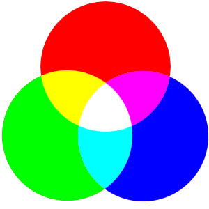

With the progression of _newer_ browsers I've started to [move my work forward](/blog/2009/05/using-html5-elements/ "Using HTML5 in your client work") and incorporate [RGBa](http://en.wikipedia.org/wiki/RGBA_color_space) (Red, Green, Blue, alpha) into my client work. Obviously the use of this will depend on the amount of visitors your site attracts and what browser they end-users are using. However, with that said, when I can get away with using `RGBa` instead of `.png` files then I will.

## Quick Refresher Course

### Hex Values

You might only be aware of one way to stipulate colour in your website designs, which will probably be a `hex` value. A hex, or hexadecimal, value is a colour code that starts with a hash and is followed by either 3 or 6 numbers, depending on the colour you are wanting to use.

The hex value of the colour red will look like `#FF0000;`

### RGB Values

`RGB` which stands for Red, Green, Blue is another way for specifying colour values on your website. However, this method is quite different to the previous. Lets take the example from the previous paragraph.

The colour red in RGB will look like `rgb(255,0,0);`

So instead of stipulating a hash, that gets replaced with rgb and instead of using 3/6 numbers they get replaced with 3 sets of numbers.

## What is RGBa and how can you use it in your work?

`RGBa` is the follow on from `RGB`, the basic principles are the same but you get one extra letter "a" which stands for alpha. This letter allows you to specify an opacity value for the colour you are declaring. As this is a newer technique it is unfortunately not yet supported by all browsers. Chris Coyier over at CSS Tricks has created a nice little table to show you the [state of the playing field](http://css-tricks.com/rgba-browser-support/ "Browser support for RGBa").

To carry on with our red example; `rgba` would look like the following `rgba(255,0,0,1)`.

The number one is located in the alpha channel which allows us to fill areas with transparent color; where you can stipulate any value between 0 and 1 (zero being fully transparent and one being fully opaque).

## Why Can't I Use Opacity For The Alpha Channel

Above I mentioned the fact that the alpha channel is a little like an opacity value. So you might be asking yourself why you can't just use the opacity value instead.

The reason I choose the word opacity was to make it easier for you to understand as you were reading this. The `RGBa` property applies transparency only to a particular element (the element the RGBa value is set on), whereas the opacity property affects the element it is applied to and all of its children.

## Defining RGBa in your Stylesheets

As I touched on above, not all browsers support RGBa, so when you do declare these you should always provide a fallback colour just incase of the worst possible outcome. Your fallback should be a solid colour, so you should either use rgb or a hex value for this.

    div { background: rgb(255,0,0); background: rgba(255,0,0,0.6); }

If you do not declare a fallback this means that nothing will be displayed, if you are viewing the website on an older browser that doesn't support this code.
